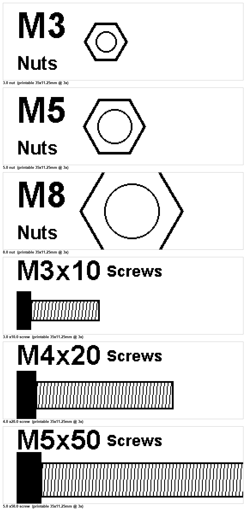

# Label & Order

Actual-size nut & bolt organisation labels for thermal label printers.

Generate crisp **M-size fastener stickers** where the nut/screw is drawn to **true
scale** — hold a real M5 nut against the "M5 Nuts" label and it matches. Print them
on an Orgstra **S001** (Xinye) label printer via
[TiMini-Print](https://github.com/ynsgnr/TiMini-Print).



## What it does

- **`gen.py`** — generates one PNG per size. Nuts are drawn by ISO hex
  width-across-flats, screws by real Ø × length. Anything larger than the label
  runs off the edge and gets cut — by design.
- **`print.py`** — prints a folder of stickers on the S001 through the TiMini CLI:
  one test sticker, you approve, then it prints the rest.

Everything is drawn at **8 dot/mm** at the printer's printable size
(280 × 90 dots = 35 × 11.25 mm), so the print is **1:1** — no scaling, real
dimensions.

## Install

Using [uv](https://docs.astral.sh/uv/):

```
uv sync
```

or plain pip:

```
python -m venv .venv
.venv\Scripts\activate        # Windows  (source .venv/bin/activate on macOS/Linux)
pip install -r requirements.txt
```

## Generate stickers

```
uv run gen.py M3 M5 M8 M5x50 M4x20 --out out --sheet
```

- `M5` → nut, `M5x50` → screw (Ø5 × 50 mm). Decimals are fine: `M2.5`.
- PNGs are written to `out/` (`M5_nut.png`, `M5x50_screw.png`).
- `--sheet` also writes `_preview.png` so you can eyeball the batch.

## Print

Printing depends on **[TiMini-Print](https://github.com/ynsgnr/TiMini-Print)**, the
S001 label-printer driver. Clone it, then point `--timini` (or the `TIMINI_DIR`
env var) at your checkout:

```
uv run print.py out --serial COM5 --timini ../TiMini-Print
```

- Prints one sticker, then asks whether to print the rest.
- `--yes` print all without prompting · `--test` first only · `--rest` all but the first.
- `--paper tag_90r_90p` is the **1:1 preset** (render 90 / length 280) — keep it so
  the fastener prints at true size.

The S001 must be paired and exposed as a serial/SPP COM port (see the TiMini-Print
README for pairing).

## Accuracy

| Item | Standard |
|------|----------|
| Nut hex width-across-flats | ISO 4032 (M3 = 5.5, M4 = 7, M5 = 8, M6 = 10, M8 = 13 mm …) |
| Bolt head (WAF × height) | ISO 4017 |
| Shaft Ø | nominal M-size |
| Shaft length | the mm value you give (`M5x50` → 50 mm) |

The printable head is **11.25 mm** (the S001 head is 12 mm but the protocol reserves
6 dots), so a nut wider than that clips top/bottom — intentional. For guaranteed
real-world size, keep the `tag_90r_90p` preset and measure your first sticker.

## Requirements

- Python 3.9+, Pillow — for generation.
- For printing: a [TiMini-Print](https://github.com/ynsgnr/TiMini-Print) checkout
  (brings `pyserial`) and a paired S001 on a COM port.
